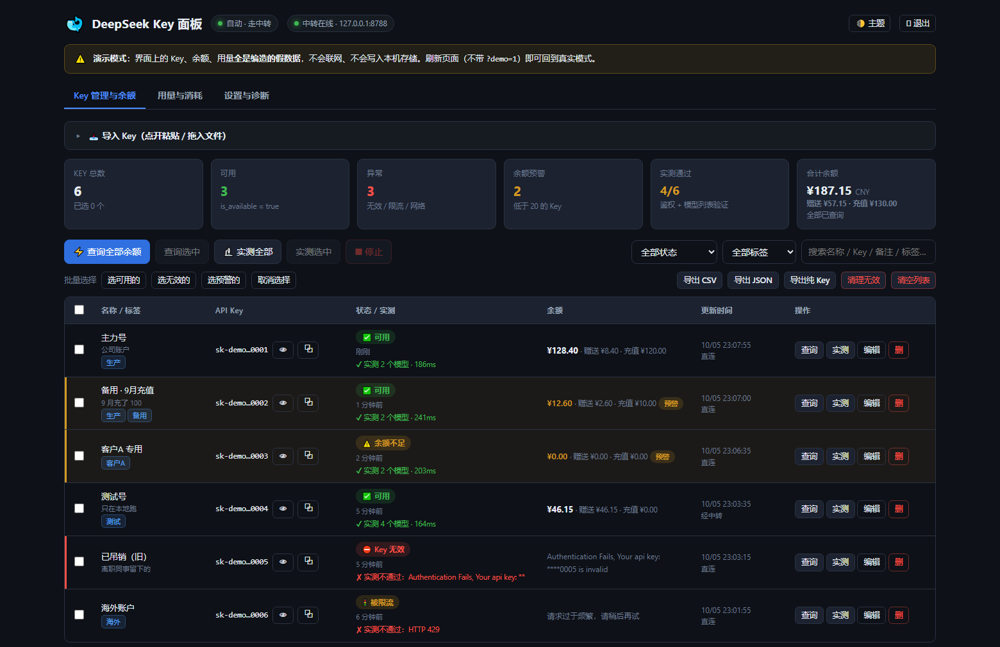
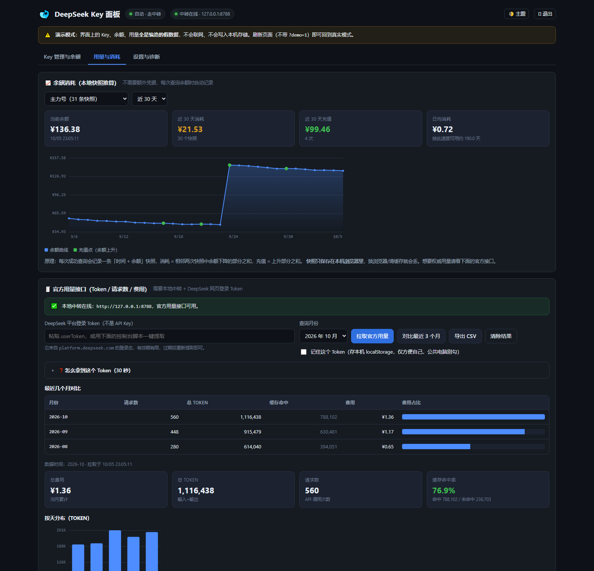

<div align="center">


# DeepSeek Key Panel

**Import your DeepSeek API keys. Check balances in bulk, verify they actually work, track usage and spend.**

A single-file web panel plus a command-line tool. **Zero third-party dependencies**, and your keys never touch a third-party server.

[](https://github.com/xiaoniao/deepseek-key-panel/actions/workflows/ci.yml)
[](https://github.com/xiaoniao/deepseek-key-panel/releases/latest)
[](LICENSE)
[](https://www.python.org/)
[](#)

[中文](README.md) · [Changelog](CHANGELOG.md) · [Contributing](CONTRIBUTING.md) · [Security](SECURITY.md)

</div>

---

## The problem

You have several DeepSeek API keys — the main account, a backup, one for a client, one for testing. You want to know:

- Which ones still have money? Which have been revoked?
- The balance endpoint works, but **can this key actually call a model?**
- How many tokens and how much money did this month cost?

The official console shows one account at a time. This tool lets you **import a pile of keys and see them all at once**.

<div align="center">
  
  <br>
  <sub><b>Key management</b> — every key's status, balance, low-balance warnings and live test results on one screen</sub>
  <br><br>
  
  <br>
  <sub><b>Usage and spend</b> — balance snapshots (spend is derived automatically) plus the platform's official token/cost report</sub>
</div>

---

## Quick start

### Option 1 — portable exe (no Python needed)

Download `DeepSeekKeyPanel.exe` from [Releases](https://github.com/xiaoniao/deepseek-key-panel/releases/latest) and **double-click it**. No Python, no registry entries — deleting the file is the uninstall.

It opens in a chromeless app window, and closing the window shuts the program down.

> If SmartScreen warns you, click "More info" → "Run anyway". That's normal for an unsigned single-file exe. A portable zip is also published as a fallback.

### Option 2 — run from source

Requires Python 3.8+ and **no third-party packages**.

```bash
git clone https://github.com/xiaoniao/deepseek-key-panel.git
cd deepseek-key-panel
python run_panel.py
```

On Windows you can also just double-click `启动面板.cmd`.

### Option 3 — command line

```bash
python -m deepseek_key_panel.cli -f keys.txt
```

Or install it as a command:

```bash
pip install .
deepseek-key-panel          # GUI
dskp -f keys.txt            # CLI
```

---

## Features

### Balances and status

- Bulk import: paste, `.txt` / `.csv` / `.json` files, or **drag a file onto the page**
- Automatic de-duplication, `sk-` detection, `Bearer ` prefix stripping, `#` comments
- Status classification: ✅ usable · ⚠️ out of credit · ⛔ invalid key · 🚦 rate limited · 🌐 network blocked · 🔧 upstream error
- Per-currency balance totals (total / granted / topped-up), search and filter
- **Graded exit codes** (CLI): `0` all good / `1` failures / `2` bad arguments / `3` below threshold

### 🔬 Usability testing

A working balance endpoint does not mean the key works. Two modes:

| Mode | What it does | Cost |
|---|---|---|
| **Quick** (default) | `GET /models` — verifies auth and lists available models | **Zero tokens** |
| **Deep** | Additionally makes one real `chat/completions` call (`max_tokens=1`) | A negligible amount |

Results appear inline: `✔ tested, 3 models · 210ms`.

### 🔻 Low-balance warnings

Set a threshold; keys below it get a highlighted row, a red balance and a counter in the summary. Optional **browser notifications** that automatically reset once the balance recovers (no repeated nagging).

### 📊 Usage and spend

- **Balance snapshot curve**: every successful check records a timestamp and balance, deriving 7/30/90-day spend, top-ups, daily burn rate and days remaining — no extra credentials needed
- **Official usage**: real token counts, request counts, cache hit rate, per-day breakdown, per-model breakdown, cost
- **Multi-month comparison**: pull the last 3 months at once and compare cost as bars
- CSV export (daily detail + per-model breakdown)

### 🏷 Organisation

Tag-based grouping, filtering by tag, batch selection by status (select all usable / invalid / warning), and a proper edit dialog (Esc to close, Enter to save).

### 💾 Backup and restore

- **Full backup**: keys, tags, notes, settings, snapshot history and usage results in one JSON
- **Export plain key list**: the current filtered result, one key per line, ready for other tools
- **Clean up invalid keys**: removes only keys returning 401; out-of-credit, rate-limited and network failures are left alone

### Other

Auto-refresh (1 min – 1 hour), light/dark themes, connection self-diagnosis, configurable concurrency/timeout/retries, and mid-run cancellation that doesn't mislabel in-flight keys as failures.

---

## CLI usage

Zero dependencies. Python talks to DeepSeek directly — **no local server needed** (that only exists for the browser).

```bash
# Check every key in keys.txt (defaults to ./keys.txt)
python -m deepseek_key_panel.cli

# Read a file, verify via /models, write CSV
python -m deepseek_key_panel.cli -f keys.txt --models --format csv --out result.csv

# Emit only usable keys, ready to pipe somewhere else
python -m deepseek_key_panel.cli -f all.txt --quiet --format txt --only ok > usable.txt

# Alert when any balance drops below 10 (exit code 3)
python -m deepseek_key_panel.cli -f keys.txt --threshold 10 || echo "low balance"

# Pull official usage
python -m deepseek_key_panel.cli --usage-token "xxx" --usage-month 2026-10

# Read from stdin
cat keys.txt | python -m deepseek_key_panel.cli --stdin --format json
```

| Flag | Description |
|---|---|
| `-f, --file PATH` | Read keys from a file (repeatable; txt/csv/json) |
| `-k, --key SK-XXX` | Supply a key directly (repeatable) |
| `--stdin` | Read from standard input |
| `-c, --concurrency N` | Concurrent requests, default 5 |
| `-t, --timeout S` | Per-request timeout in seconds, default 20 |
| `--retries N` | Retries on failure, default 1 |
| `--models` | Also verify via `GET /models` (no token cost) |
| `--chat` | Also make one real call (costs money; use sparingly) |
| `--threshold N` | Flag balances below this value and exit with code 3 |
| `--format` | `table` (default) / `json` / `csv` / `txt` |
| `--only` | `ok` / `low` / `failed` / `all` |
| `--out PATH` | Write to a file |
| `--show-key` | Print full keys in the table (masked by default) |

---

## The honest bit about the APIs

Bottom line first: **DeepSeek does not expose an API-key-authenticated endpoint for historical usage.** The official docs only cover balance. Any tool claiming to produce usage from an API key alone is either scraping the web session or accounting for it locally.

Verified in October 2026:

| Endpoint | API key? | Browser CORS | What you get |
|---|---|---|---|
| `GET api.deepseek.com/user/balance` | ✅ | ✅ echoes any Origin | Balance, granted, topped-up, `is_available` |
| `GET api.deepseek.com/models` | ✅ | ✅ preflight allowed | Model list → used for usability testing |
| `POST api.deepseek.com/chat/completions` | ✅ | ✅ preflight allowed | Real call → used for deep testing |
| `GET platform.deepseek.com/api/v0/usage/amount` | ❌ needs web session token | ❌ **no CORS headers at all**, OPTIONS returns 405 | Token usage, request counts, cache hits |
| `GET platform.deepseek.com/api/v0/usage/cost` | ❌ same | ❌ same | Cost |

Hence the two paths:

- Balance / usability / real calls → **direct from the browser** (the default; no backend needed)
- Real usage → either the web session token against the platform's internal endpoint (proxied by the local server), or local bookkeeping (the balance snapshot feature)

> **Gotcha:** the usage endpoint can return **HTTP 200 and still have failed**. The body is an envelope like `{"code":40003,"msg":"Authorization Failed (invalid token)"}`. This tool checks the `code` field, not the HTTP status.

---

## Getting the platform session token

**Only needed for official usage. Balance checks don't need it.**

Log in to [platform.deepseek.com](https://platform.deepseek.com), press `F12`, paste this into the console and hit Enter — the token lands on your clipboard:

```js
(function(){
  var KEYS = ["userToken","token","access_token"];
  function grab(v){
    if(!v) return null;
    try { var o = JSON.parse(v); if(o && typeof o === "object")
      return o.token || o.value || o.access_token || o.userToken || null; } catch(e){}
    return (typeof v === "string" && v.length > 20) ? v : null;
  }
  for (var i=0;i<KEYS.length;i++){
    var t = grab(localStorage.getItem(KEYS[i]));
    if (t) { copy(t); console.log("usage token copied"); return; }
  }
  for (var k in localStorage){
    var t2 = grab(localStorage.getItem(k));
    if (t2) { copy(t2); console.log("usage token copied (from "+k+")"); return; }
  }
  console.log("no token found - check Application -> Local Storage manually");
})();
```

Manually: `F12` → **Application** → **Local Storage** → `https://platform.deepseek.com` → find `userToken` and paste the whole value; the panel extracts the token from it.

> This token is a **session credential** with the same privileges as your account, and it expires. Never share it.

---

## Security

- Every request goes from **your browser** or **your local Python** straight to `api.deepseek.com` / `platform.deepseek.com`. **No third-party server is involved** — there is no "send us your key to check it" step.
- The local server binds to `127.0.0.1` only; it is unreachable from your LAN or the internet. It forwards only to the two allow-listed hosts, never forwards cookies, and never writes keys to disk.
- Keys are **not** persisted in the browser by default (they vanish on refresh) unless you tick the remember box.
- CSV/JSON exports mask keys by default; "export plain keys" and "full backup" are cleartext and require explicit confirmation.
- Full threat model and trade-offs in [SECURITY.md](SECURITY.md).

> ⚠️ Mask your keys before screenshotting or pasting logs. If a key leaks, revoke it in the DeepSeek console first.

---

## FAQ

**Can I check balances without the local server?**
Yes. All `api.deepseek.com` endpoints support CORS (they echo any Origin, including `null` from `file://`). You can even open `src/deepseek_key_panel/web/index.html` directly.

**Why does official usage require the local server?**
`platform.deepseek.com` sends no `Access-Control-Allow-*` headers at all and its `OPTIONS` preflight returns 405. The browser's same-origin policy blocks it; only a local process can make that call.

**Quick or deep test?**
Quick (`/models`) is enough day to day — it distinguishes "revoked key" from "working key" at zero cost. Deep testing is for when a key shows a balance but every model call fails.

**Port already in use?**
Default is 8787, and it walks up to 8798; the panel scans that range automatically. Or pass `--port 9000`.

**Usage page says the token is invalid?**
Web sessions expire. Log in again and re-run the snippet above.

**Do snapshots sync across devices?**
No, they live in your browser's localStorage. Use "full backup" and restore it elsewhere.

**Will antivirus flag the exe?**
PyInstaller single-file exes are commonly flagged by heuristics. Run from source instead, build your own with `python build.py`, or use the portable zip.

---

## Development

```bash
git clone https://github.com/xiaoniao/deepseek-key-panel.git
cd deepseek-key-panel

python tests/run_all.py      # the whole self-check suite
```

The suite runs: Python syntax compilation → inline JS extraction and structural checks → `node --check` → **ID cross-referencing** → 77 pure-logic assertions → a real server smoke test → CLI smoke tests.

> Don't skip `tests/check_ids.py`. A typo in `$("#xxx")` in the panel fails **silently** and is nearly impossible to spot by eye — that script exists to catch exactly that.

Building the portable exe:

```bash
python -m pip install pyinstaller
python build.py                 # single-file, no console window
python build.py --all           # single-file exe + portable zip
python build.py --console       # keep the console for debugging
```

### Layout

```
src/deepseek_key_panel/
├─ app.py            Desktop entry: start server, open chromeless window, lifecycle
├─ server.py         Local HTTP server + proxy (stdlib only)
├─ cli.py            Command-line interface
└─ web/index.html    The entire frontend (single file, no framework, no CDN)
```

One rule when touching the frontend: **`web/index.html` must stay self-contained.** No frameworks, no CDNs, no build step — "double-click and it works" is the whole point of this project.

See [CONTRIBUTING.md](CONTRIBUTING.md) for details.

---

## Related projects

Other open-source takes on the same problem, with different trade-offs:

- [Joyi-code/DeepSeekMonitorWindows](https://github.com/Joyi-code/DeepSeekMonitorWindows) —
  Tauri + Rust desktop monitor, the most featureful, but needs a Rust toolchain to build
- [crazywoola/dsh-balance](https://github.com/crazywoola/dsh-balance),
  [songoao25/dsh-bottom-info-bar](https://github.com/songoao25/dsh-bottom-info-bar),
  [Han-1413141/dsh-cost-meter](https://github.com/Han-1413141/dsh-cost-meter),
  [Suiwan/whale-purse](https://github.com/Suiwan/whale-purse) — DeepSeek Harness plugins
- [zhuifengshaonian6/api-balance-checker-extension](https://github.com/zhuifengshaonian6/api-balance-checker-extension) —
  browser extension for multiple relay providers
- [CWNU-Open-Source-Community/DeepSeekMeter](https://github.com/CWNU-Open-Source-Community/DeepSeekMeter) —
  macOS menu bar app

This project's usage-endpoint calling convention was informed by DeepSeekMonitorWindows, but the code is an independent implementation.

---

## License

[MIT](LICENSE) © 2026 xiaoniao

Not affiliated with or endorsed by DeepSeek. The platform's pages and internal endpoints may change at any time; long-term availability is not guaranteed.
